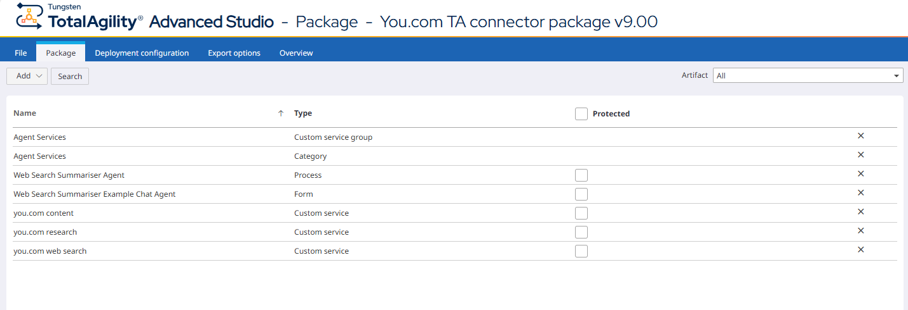
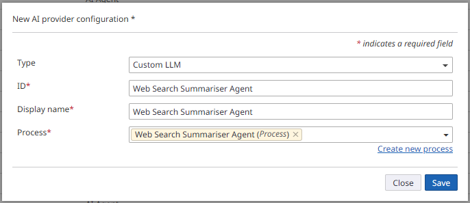

# TotalAgility – You.com Search Services Connector

This project provides integration between **Tungsten TotalAgility (aka TTA or KTA)** and **[You.com](https://you.com)**'s AI-powered search services. Two integration approaches are covered: **MCP (Model Context Protocol)** and **REST API**.

You.com offers three core capabilities that this connector exposes to TotalAgility:

| Capability | Description |
|------------|-------------|
| **Search** | Returns real-time, LLM-ready web and news results |
| **Research** | Multi-step reasoning with web research capabilities |
| **Content** | Retrieves HTML or Markdown content from any webpage |

> For full details on available APIs see: <https://you.com/apis>

---

## Table of Contents

- [Prerequisites](#prerequisites)
- [Approach 1 – MCP Server](#approach-1--mcp-server)
- [Approach 2 – REST API](#approach-2--rest-api)
- [Project Contents](#project-contents)
- [Importing the TotalAgility Package](#importing-the-totalagility-package)
- [Resources](#resources)

---

## Prerequisites

Before you begin, choose **one** of the two integration paths below. Each path has its own prerequisite.

### Option A – MCP Server (no API key required)

You.com provides a **free MCP server** that can be used directly by compatible agents without needing an API key.

👉 **Get started:** <https://docs.you.com/build-with-agents/mcp-server>

### Option B – REST API (API key required)

To call the REST APIs you will need a valid You.com API key. There are two ways to obtain one:

| Tier | Details |
|------|---------|
| **Free** | Create a free account on the You.com platform. As of March 2025 this includes **$100 in free credits**. |
| **Paid** | Purchase a paid plan for higher rate-limits and production usage. |

👉 **Create your API key:** <https://you.com/platform>

---

## Approach 1 – MCP Server

The **Model Context Protocol (MCP)** approach allows TotalAgility agents to consume You.com's search, research, and content capabilities through a standards-based MCP server. This is the simplest way to get started — no API key management is required.

### How it works

1. The TotalAgility agent connects to You.com's hosted MCP server.
2. The MCP server exposes **Search**, **Research**, and **Content** tools.
3. The agent invokes tools via the MCP protocol; results are returned inline.

### Supported MCP Tools

| Tool | Description |
|------|-------------|
| `search` | Perform a web search and receive AI-summarised results |
| `research` | Conduct deep research with cited sources |
| `content` | Generate content grounded in live web data |

As of TotalAgility 2026.1 MCP is supported for use in **Generative AI chat controls**, for both Generative AI and AI Knowledge Base / Knowledge Discovery use cases.

In the TotalAgility 2026.2 & 2026.3 releases, support for MCP will be expanded to include consumption of MCP services (aka "Tools") via activity steps in TotalAgility workflows, automation processes and custom agents. 

### Step-by-Step Setup
To configure MCP consumption in in **Generative AI chat controls** in TotalAgility 2026.1+.

#### Step 1 – Add the MCP Server

Open **TotalAgility Advanced Studio** and navigate to **Integration → MCP Server**. Add the You.com MCP server URL to the configuration page.

> MCP Server URL can be found at: <https://docs.you.com/build-with-agents/mcp-server>


#### Step 2 – Configure the Generative AI chat control

On your TotalAgility form, add or configure a **Generative AI chat control** and set it to use the newly added MCP service.


#### Step 3 – Test it out

Run the form and interact with the chat control. The agent will now have access to You.com's Search, Research, and Content tools via MCP.


### Example Prompt

An example prompt for formatting agent responses is provided in [`prompts/TA_Chat_Formatting_Example.md`](prompts/TA_Chat_Formatting_Example.md). This demonstrates how to instruct the agent on brand-consistent output formatting for use within TotalAgility chat controls.

---

## Approach 2 – TotalAgility Custom Services using the you.com REST API

The **REST API** approach gives full programmatic control over You.com's services. This is ideal when you need to call the APIs from TotalAgility workflows, automation processes or agents. 

The sample package provided includes REST integrations packaged as TotalAgility Custom Services, and an example showing how to use the search Custom Service in a TotalAgility Agent.

### Authentication

All REST API calls require an API key passed via the `X-API-Key` header:

```
X-API-Key: <YOUR_API_KEY>
```

The TotalAgility package included in this project stores the API key in a **Global Variable** so it can be managed securely and referenced across services.

👉 **Note:** Be sure to update this variable with your API key before using the samples. 

### Getting Started

1. Obtain an API key from <https://you.com/apis>. Create an account to access the $100 free credits for API testing and to generate a key. 
2. Import the TotalAgility package (see [Importing the TotalAgility Package](#importing-the-totalagility-package)) to deploy the custom services into your TotalAgility   environment.
3. Update the ```youcom api key``` under "TotalAgility Studio Advanced" > "System data" > "Server variables" with your api key.
4. Test the custom services standalone or see the example processes and forms.
5. Postman examples are provided to explore the native you.com APIs.  

### Available Endpoints
The following you.com API methods are used to provide the TotalAgility Custom Services contained in the package. These Custom Services are in a category / group called "Agent Services". 

| TA Custom Service | you.com Endpoint | Method | Description |
|-------------------|------------------|--------|-------------|
| you.com web search | Search | `GET` | Web search with AI snippets |
| you.com research | Research | `POST` | Deep research with citations |
| you.com content | Content | `POST` | Content generation from live web data |

> Full API reference & quickstart: <https://docs.you.com/quickstart>

---

## Project Contents

```
├── README.MD                  # This file
├── images/                    # Screenshots and diagrams
│   ├── mcp_setup/             #   - MCP setup walkthrough screenshots
│   └── TA_configuration/      #   - TotalAgility configuration screenshots
├── packages/                  # TotalAgility export package (.zip)
├── postman/                   # Postman collection & environment
│   └── ...                    #   - Pre-built requests for Search, Research & Content APIs
├── prompts/                   # Example prompts for TotalAgility agents
│   └── TA_Chat_Formatting_Example.md
├── response_data_models/      # Example API responses to create data models in TotalAgility
│   └── search_response.json
```

### TotalAgility Package Includes

| Name | Type | Description |
|------|------|-------------|
| Agent Services | Custom service group | Groups all You.com custom services |
| Agent Services | Category | Organisational category for all connector artefacts |
| you.com web search | Custom service | Returns real-time, LLM-ready web and news results |
| you.com research | Custom service | Multi-step reasoning with advanced web research capabilities |
| you.com content | Custom service | Retrieves HTML or Markdown content from any webpage |
| Web Search Summariser Agent | Process | Example agent process demonstrating the Search API integration |
| Web Search Summariser Example Chat Agent | Form | Example chat form wired to the Web Search Summariser Agent |



#### Custom Services
Creates a ```Custom Service Group``` called ```Agent Services```.

**you.com web search**: Returns real-time, LLM-ready web and news results.
**you.com contents**: Retrieves HTML or Markdown content from any webpage.
**you.com research**: Multi-step reasoning with advanced web research capabilities.

#### Global Variable
The package imports a global variable called ```YOUCOMAPIKEY``` in the "Agent Services" category. 

Update this variable to contain your you.com API key.

#### Web Service Definitions
 - youcom web search: Web service reference for the search API (HTTP GET)
 - youcom contents: Web service reference for the contents API (HTTP POST)
 - youcom research: Web service reference for the research API (HTTP POST)


### Postman Collection

The [`postman/`](postman/) folder contains ready-made requests for each You.com API endpoint. Use these to explore and test the APIs before deploying into TotalAgility.

👉 Note that an environment variable should be used to configure the you.com ```X-API-Key``` under the Authorization tab of this collection. The imported collection looks for this key in an environment variable called ```{{you.com api key}}```.

---

## Importing the TotalAgility Package

To deploy the connector into your TotalAgility environment:

1. Open **TotalAgility Designer**.
2. Navigate to **Settings → Import / Export → Import Package**.
3. Select the package file from the [`packages/`](packages/) directory.
4. Follow the import wizard to map any environment-specific settings.
5. After import, update the **Global Variable** with your You.com API key.

> 📖 For detailed import instructions see the official documentation:
> <https://docshield.tungstenautomation.com//TotalAgility/en_US/2026.1-sy4i5uG9Tu/help/Designer/All_Shared/Import/t_importpackage.html>

### Configuring the Web Search Summariser Agent

The package includes an example agent called **Web Search Summariser Agent**. To use it, you must register the agent process as a **Custom LLM** in TotalAgility:

1. Open **TotalAgility Advanced Studio**.
2. Navigate to **Integration → Generative AI**.
3. Add a new **Custom LLM** entry and map it to the imported agent process.



Once configured, the Custom LLM will be available for use in Generative AI chat controls and other TotalAgility components that support LLM integration.

---

## Resources

| Resource | Link |
|----------|------|
| You.com APIs Overview | <https://you.com/apis> |
| You.com Quickstart Guide | <https://docs.you.com/quickstart> |
| You.com MCP Server Docs | <https://docs.you.com/build-with-agents/mcp-server> |
| You.com Platform (API Keys) | <https://you.com/platform> |
| TotalAgility – Import Package | <https://docshield.tungstenautomation.com//TotalAgility/en_US/2026.1-sy4i5uG9Tu/help/Designer/All_Shared/Import/t_importpackage.html> |
